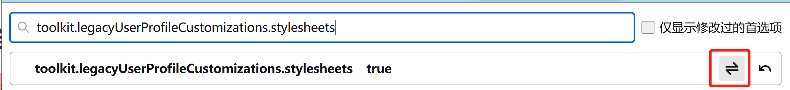

# firefox自动隐藏显示工具栏

## 1. 开启自定义UI userChrome.css 功能

```
about:config > toolkit.legacyUserProfileCustomizations.stylesheets > true
```


**toolkit.legacyUserProfileCustomizations.stylesheets**




## 2. 找到 Firefox 运行环境配置目录

要启动 Firefox 配置文件夹，请在 Firefox 中单击菜单>帮助>故障排除信息。


单击配置文件文件夹右侧的“打开文件夹”按钮以将其打开。


## 3. 创建定制UI目录和文件 

如果在出现的配置文件夹中看到一个 chrome 文件夹，双击进入 chrome 文件夹目录。 但是 Firefox 默认是没有这个文件夹的，没有那我们就新建一个 chrome 文件夹就好了。


 

在chrome文件中创建文件 “ userChrome.css ” 文件。


## 4. 修改文件内容如下：

```css
:root[sessionrestored]
#navigator-toolbox:not([inFullscreen="true"]):not(:focus-within):not(:hover) #nav-bar,
:root[sessionrestored]
#navigator-toolbox:not([inFullscreen="true"]):not(:focus-within):not(:hover) #PersonalToolbar {
    height: 0 !important;
    min-height: 0  !important;
    opacity: 0  !important;
}

#navigator-toolbox:not([inFullscreen="true"]) {
    --tab-min-height: 20px !important;
}
```


## 5. 重启 Firefox

