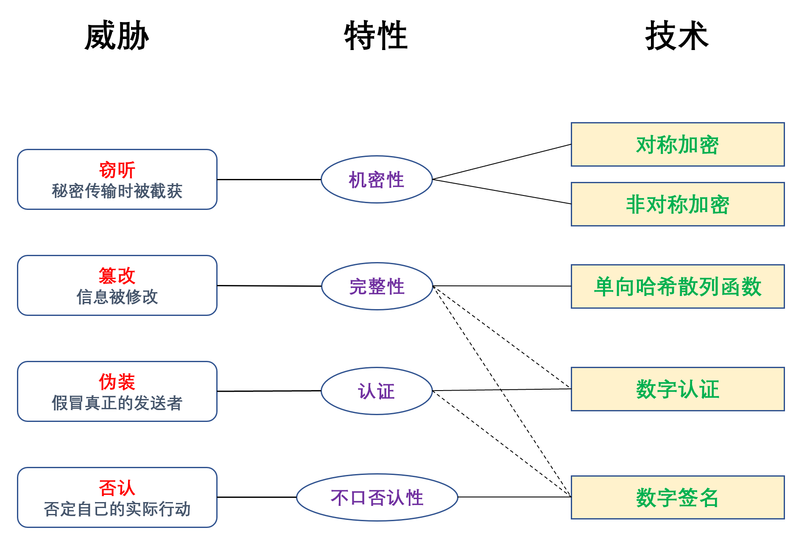
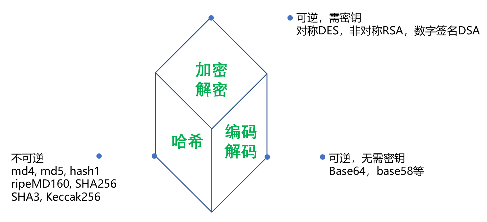

# 密码学

- [各种hash函数对比](https://en.wikipedia.org/wiki/SHA-1#Comparison_of_SHA_functions)
- **openssl加密解密** —— <http://www.openssl.org/source/>
  - [openssl编译安装](openssl/install.md)
  - [openssl命令详解](openssl/command.md)

- [OpenSSL从基础到应用系列](openssl.base2app/readme.md)

---

- **应用**

- **分类**

