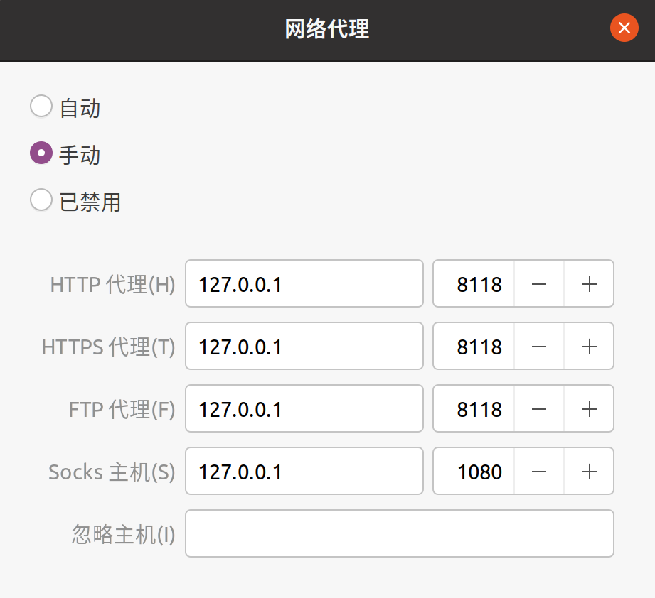

# shadowsocks 客户端端配置

## 1. 命令行启动

有两种启动方式，建议使用配置文件的方式启动

### 1.1 直接命令方式

```bash
sslocal -s x.x.x.x -p 8388 -k "password" -b 127.0.0.1 -l 1080
```

### 1.2 配置文件方式

```bash
vim /etc/sslocal.json
```

```json
{
    "server":"x.x.x.x",
    "server_port":8388,
    "local_address": "127.0.0.1",
    "local_port":1080,
    "password":"password",
    "timeout":300,
    "method":"rc4-md5"
}
```

```bash
sslocal -c /etc/sslocal.json
```

#### 自动启动

```bash
vim /etc/supervisor/conf.d/sslocal.conf
```

```ini
[program:sslocal]
command=/bin/bash -c 'sslocal -c /etc/sslocal.json'
user=root
autostart=true
autorestart=true
redirect_stderr=True
stdout_logfile=/tmp/sslocal.log
stderr_logfile=/tmp/sslocal.err
```

```bash
service supervisord start
supervisorctrl update
```

## 2. Socks5转换为Http

```bash
apt -y install privoxy
```

```bash
vim /etc/privoxy/config
```

```bash
listen-address 127.0.0.1:8118    # 行783，去掉前面的注释符号, 此处如果是localhost，请改为127.0.0.1，因为可能最后是ipv6的地址，导致127.0.0.1不可用
forward-socks5t / 127.0.0.1:1080 .  # 行1336，去掉前面的注释符号，后面的1080端口要对应ss服务里面的配置，要一致
```

```bash
/etc/init.d/privoxy start
```

> 8118端口走http协议，1080走socks5协议，socks5会经过http，这样间接的ss也能支持http协议了.

## 3. 应用

### 3.1 系统界面全局模式

系统设置 -> 网络 -> 网络代理 -> 方法 -> 手动



应用到整个系统即可。

### 3.2 命令行应用

ss客户端已经安装配置完成，但命令行还不能上网，因为ss属于socks5协议，有的系统不能全局使用，所以需要把socks5转为http协议(privoxy)。

```bash
echo '' >> ~/.bashrc
echo 'function myproxy() {' >>  ~/.bashrc
echo '        export https_proxy=http://127.0.0.1:8118' >>  ~/.bashrc
echo '        export http_proxy=http://127.0.0.1:8118' >>  ~/.bashrc
echo '        export ftp_proxy=http://127.0.0.1:8118' >>  ~/.bashrc
echo '}' >>  ~/.bashrc
```

```
source ~/.bashrc
myproxy
curl www.google.com
```

