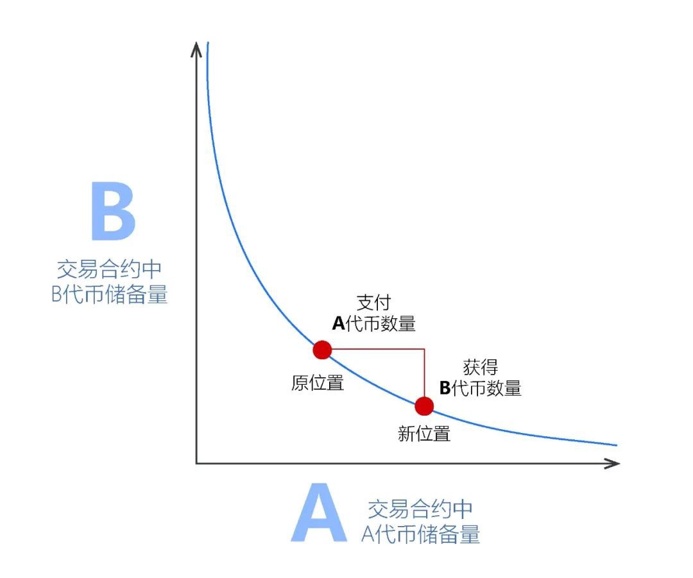
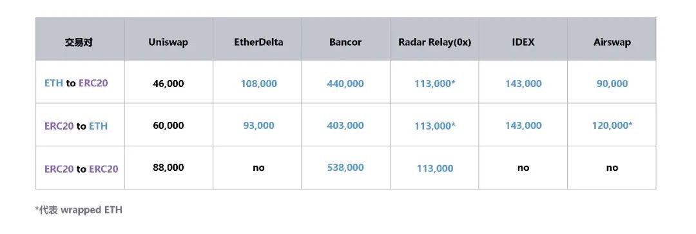

# uniswap

DeFi科普系列之（一）：Uniswap到底是怎么运转的？

原报告链接：

https://www.mycryptopedia.com/what-is-uniswap-a-detailed-beginners-guide/

翻译&校对：Cortex Labs（CTXC）运营团队

Uniswap是一种基于以太坊的协议，旨在促进ETH和ERC20 代币数字资产之间的自动兑换交易。Uniswap完全部署在链上，任何个人用户，只要安装了去中心化钱包软件（当前已经支持的钱包包括 MetaMask、WalletConnect、Coinbase Wallet、Fortmatic、Portis），都可以使用这个协议。Uniswap也可以被认为是一个DeFi项目，因为它试图利用去中心化协议来让数字资产交易过程中彻底实现去中介化。

## Uniswap 中包含两种类型智能合约：

交易合约

工厂合约

这些智能合约是用Vyper智能合约编程语言来编写的，它们是Uniswap协议实现各种功能的核心组成。一个交易合约支持一种ERC20代币，每一个交易合约都储备持有一定量的ETH以及支持的这种ERC20代币。这意味着，在某个ERC20代币-ETH交易合约中执行的交易，都是基于这个合约中的 ETH和此种ERC20代币的相对供应量来实现的。

通过ETH作为中间介质，交易合约还可以实现一种ERC20代币与另一种 ERC20代币的直接交易。

工厂合约可用于部署新的交易合约，因此，任何还没有在Uniswap上面有交易合约的ERC20代币，都可以使用工厂合约来部署一个交易合约。任何以太坊的用户都可以通过‘createExchange()’函数实现这一点。工厂合约扮演了Uniswap中交易合约“注册中心”的角色，工厂合约可以用来查找所有已经被添加进Uniswap系统里面ERC20代币和交易地址。在一个交易合约发布后，工厂合约不会对此交易合约中的ERC20代币做类似背景调查之类的操作，只有一个“一交易合约只包含一种ERC20代币”的限制。因此，用户应该只参与那些自己信任的ERC20代币项目的交易行为。

## Uniswap 的资产流动性

Uniswap协议的设计结构体系与传统数字资产交易所中的交易模型完全不同。大多数传统交易所都是通过维护一个“订单簿”，来匹配一种数字资产的买卖双方。Uniswap则完全不同，它是利用储备金流动性来实现协议上的数字资产交易兑换。

交易合约中的储备金是由众多“流动性提供者”来提供的。这些流动性提供者将等值的ETH以及ERC20代币充值到这个交易合约中。第一个向此合约中提供流动性的流动性提供者就拥有设置此ERC20代币与ETH之间兑换汇率的权利。第一个流动性提供者把自己认为等价值的ETH数量和ERC20代币数量充值到此交易合约，就可以实现设置汇率。而如果第一个流动性提供者设置的这个汇率和外面更大盘的市场不一致，那么套利交易者就会通过搬砖来把这些价差抹平，和大盘保持一致的汇率。此后所有流动性提供者将以其充值时的汇率作为计算等价的依据。

Uniswap还发行了一种“流动性代币”，这种流动性代币也符合ERC20标准。这个流动性代币代表流动性提供者对这个交易合约的贡献。Uniswap设置“一个交易合约只支持一种ERC20代币”这样的限制，背后的逻辑是：鼓励流动性提供者将他们提供的流动性集中到一个交易合约的储备金中。Uniswap发行流动性代币，就是为了追踪每个流动性提供者贡献的储备金占总储备的比例。而流动性提供者可以选择在任何时间销毁自己持有的流动性代币，然后就可以把对应比例份额的ETH和该种ERC20代币从交易合约中赎回出来了。

流动性提供者也可以选择直接出售或者转移其持有的流动性代币，而无需从交易合约中移除流动性。不过，Uniswap流动性代币严格限定在一个交易合约中，并不存在一个和Uniswap协议相关联的单独的基础原生数字资产。流动性提供者通过调用“addLiquidity()”函数来把流动性充值到此交易合约中，而一旦有交易发生，作为回报，流动性提供者将会获得一定份额的交易手续费。

## Uniswap 上的交易类型之一：ETH ⇄ ERC20 交易

在Uniswap上可以进行的交易中的一种，就是ETH和ERC20代币之间的交易。就像前面提到的，这个交易对的汇率取决于此交易合约内ETH和该 ERC20代币流动性池的相对规模。这个交易汇率是由Uniswap的恒定乘积公式来决定的：

ETH 池 * token 池 = 恒定乘积值

在Uniswap上执行任何交易，此恒定乘积值都保持不变。

只有当此交易合约中的流动性池发生变化的时候，此恒定乘积值才会发生变化。

我们用 ETH ⇄ BAT（一种ERC20代币）来举例：

Bob想要发起交易来用自己的1个ETH兑换成ERC20代币BAT，Bob将使用 Uniswap上已经存在的BAT交易合约来实现此兑换操作。此时，流动性提供者已经将一定量的ETH和BAT存在了交易合约中。我们这里举例，流动性提供者一共存了10ETH和500BAT。因此，基础的恒定乘积值为：

ETH 池 * BAT 池 = 恒定乘积值

ETH 池 = 10

BAT 池 = 500

恒定乘积值 = 500 * 10 = 5000

Bob将通过向交易合约的ETH池发送1ETH来启动这笔交易，此时，交易金额的0.3%也就是0.003ETH将被扣除作为给流动性提供者的报酬。剩余的0.997ETH则被添加到了ETH池里面。然后，恒定乘积值除ETH池中新的ETH数量，来得到BAT池中应该有的数量。那么多出来的BAT，就可以分给Bob了。具体如下：

Bob发送了 1 ETH

费用 = 0.003 ETH

ETH 池 = 10 + (1–0.003) = 10.997

BAT 池 = 5000/10.997 = 454.67

Bob 将兑换得到 : 500–454.67 = 45.33 BAT

这个在Bob开始交易时收取的流动性提供者费用，现在又重新添加到ETH流动池里面。这是对流动性提供者的一种报酬，当这些流动性提供者从流动池中取回自己的ETH和ERC20代币时，可以获得这些报酬。由于这些流动性提供者的报酬是在上述兑换交易计算后才添加回ETH流动池里面，因此在交易合约上每执行一次交易，恒定乘积值就会增加一点，这就让流动性提供者为交易合约提供流动性这件事儿，成为一种有利可图的行为。这笔交易完成后，

ETH 池 = 10.997 + 0.003 = 11

BAT 池 = 454.67

新的恒定乘积值 = 5,001.37

在这次交易中，Bob兑换的汇率为 45.33 BAT/ETH

1 ETH 入

45.33 BAT 出

汇率 = 45.33 BAT/ETH

## Uniswap 上的交易类型之二：ERC20 ⇄ ERC20 交易

在Uniswap上可进行交易类型中的另一种，就是ERC20代币兑换为另一种ERC20代币。由于ETH是被当作所有ERC20代币的公共交易对，因此Uniswap使用ETH作为中介资产，来实现ERC20代币和ERC20代币之间的兑换交易。例如，Uniswap可以实现：在一个交易合约中把BAT兑换为ETH，再在另一个交易合约中将ETH兑换为OMG（举例另一种ERC20代币），这些都是发生在一个交易操作里面。

前面提到的这个乘积恒定公式和一般市场非常相似，因为你想购买的代币越多，此交易的边际汇率就会越高。后面我们会再详细介绍这一部分。

## Uniswap 收费标准

Uniswap对已经发生的交易收费标准如下：

ETH/ERC20代币交易：ETH交易额的0.3%

ERC20代币/ETH代币交易：ERC20代币交易额的0.3%

ERC20/ERC20交易：卖出ERC20代币交易额的0.3%以及中间介质ETH交易额的0.3%

## Uniswap 代币交易汇率

Uniswap用来确定token交易汇率的恒定乘积公式，最初来源自2018年3月Vitalik Buterin发表过的一篇文章中。此文中表述，根据以下公式来计算ERC20代币的交易汇率：

x * y = k

k 表示一个不变的常数

x 和 y 表示特定交易对中ETH和ERC20代币的可用数量。

对于Uniswap而言，则是该ERC20代币和ETH的交易合约中ETH和该ERC20代币的流动性池的储备量。在这个公式中，该ERC20代币和ETH的兑换汇率，将始终处于此公式结果曲线上的某一点。

这个公式是Uniswap协议的组成部分，Vitalik Buterin使用下面这个图来对其进行描述：

使用此公式，如果以Uniswap中的交易合约举例，则代表该交易合约储备有 x 数量的A代币和 y 数量的B代币。这个合约将始终保持乘积恒定，也就是说 x * y 得到的 k 值不变。

任何人都可以通过有效改变做市商在 x* y 曲线上的位置来进行买入或者卖出代币。

横轴代表卖出的A代币的数量，纵轴代表买入的B代币的数量。

假设B代币是ETH，而A代币是任意一种ERC20代币，我们可以通过 x * y = k 的公式来理解一下它们的功能：

如果Alice决定买入大量A代币，那么将导致A代币的紧缺，并且导致ETH数量的增加。Alice购买的行为导致了把汇率移动到了 x * y = k 曲线上的另一个点。红点将向左移动，也就是买入A代币的价格变得更加高。也可以将Uniswap的交易合约中的ETH和A代币的相对供应理解为A代币的供需关系，这种供需关系决定了A代币与ETH之间的汇率。

如前所述，第一个为交易合约提供流动性的充值操作，并不取决于交易汇率。而是反过来，后面的交易汇率，将取决于第一次为交易合约提供流动性的这个充值操作充值了多少ETH和ERC20代币，用第一个流动性提供者认为的等值，来反映ERC20/ETH的兑换汇率。如果这个汇率和市场对比过高或者过低，套利交易者都会很快把差距抹平，直到市场正常水平。

## Uniswap 和套利交易

有一点需要强调，尽管Uniswap是一个去中心化的链上数字资产交易平台，但它并不是为了取代中心化交易所的。因为如果Uniswap上的交易机制出现偏差，则必须存在一个正常的交易机制来对此进行纠正。这个纠正的过程，就是以套利交易的形式存在。

套利交易是一种利用不同交易市场之间的价差进行获利的交易策略。在数字加密货币领域，某一种加密货币资产在不同的交易所之间可以找到价差。如果交易者发现了套利交易的机会，那么他们将会在一个交易市场买入此种加密货币，而在另一个交易市场卖出此种加密货币。套利交易对于Uniswap的功能至关重要，因为套利交易者可以利用其他加密货币交易所中存在的汇率来对Uniswap上可能出现的汇率偏差进行纠正。

## Uniswap 和 Gas 消耗

使用Uniswap协议来兑换交易的优点之一，是在Uniswap上交易产生的Gas成本相对于其他去中心化交易所，非常低。Gas消耗水平如下表所示，ERC20/ETH、ETH/ERC20、ERC20/ERC20，比Bancor、EtherDelta都要低很多。

节省Gas只是Uniswap协议的优点之一，更多优点还包括：

Uniswap是去中心化的，因此，它不依赖任何第三方。此外，它对任何用户都是免费访问的。和其他数字资产交易平台相比，Uniswap上进行交易的成本更低。Uniswap允许任何用户创建任何ERC20代币的交易合约。

当然，Uniswap也存在其局限性：

Uniswap确实是依赖套利交易来保证交易汇率和市场一致，这意味着Uniswap是依赖其他交易所的交易汇率来保障自己的的汇率平衡。

Uniswap目前仍处于试验阶段，需要在其中进行更多开发，来关注它在促进数字资产交易方面的效率。

## 结语

总而言之，Uniswap使数字资产交易变得更加高效。不过，Uniswap尚且处于起步阶段，最令人期待的还是未来的发展。