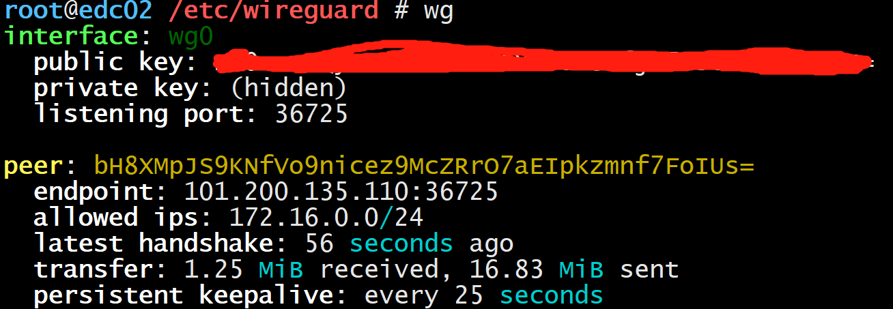

# ubuntu wireguard 安装配置

>  wireguard+shadowsocks+nginx组合可以成为绝佳的翻墙工具。

## 1. 配置

| 位置 | 内网ip       | 外网ip |
| -----| ------------- | --- |
| 北京 | 172.16.0.193 | 101.200.135.110 |
| 香港 | 192.168.1.237 | 47.243.90.111 |

主机的系统都是 Ubuntu 16.04

## 2. 安装

### 2.1 安装

```bash
# root执行，没有前两步也行
add-apt-repository ppa:wireguard/wireguard
apt-get update

apt-get install wireguard-dkms wireguard-tools resolvconf -y
```

### 2.2 开启服务器的 ipv4 流量转发

```bash
echo "net.ipv4.ip_forward = 1" >> /etc/sysctl.conf
sysctl -p
```

### 2.3 创建 WireGuard 文件夹并设置权限

```
mkdir -p /etc/wireguard && chmod 0777 /etc/wireguard
cd /etc/wireguard
umask 077
```

### 2.4 生成密钥对

```
wg genkey | tee privatekey | wg pubkey > publickey
```

## 3. 分别在两台主机上配置互通

### 3.1 北京

```ini
vim /etc/wireguard/wg0.conf

[Interface]
	PrivateKey = 8EZxYM65aOWZzZXH20KYNXhr/Ypmk9f9bigE8=     # 北京的privatekey
	ListenPort = 36725
	PostUp = iptables -A FORWARD -i wg0 -j ACCEPT; iptables -t nat -A POSTROUTING -o  ens3   -j MASQUERADE; ip6tables -A FORWARD -i wg0 -j ACCEPT; ip6tables -t nat -A POSTROUTING -o  ens3  -j MASQUERADE
	PostDown = iptables -D FORWARD -i wg0 -j ACCEPT; iptables -t nat -D POSTROUTING -o  ens3  -j MASQUERADE; ip6tables -D FORWARD -i wg0 -j ACCEPT; ip6tables -t nat -D POSTROUTING -o  ens3  -j MASQUERADE

[Peer]
	PublicKey = RS0sz+BDOXriUB8FfjE7JscDl51QwWQE=      # 香港的publickey
	AllowedIPs = 192.168.1.0/24
	Endpoint = 47.243.90.111:36725
	PersistentKeepalive = 25
```


### 3.2 香港

```ini
[Interface]
        PrivateKey = 2DlBQXFQ6+RL1m6HotQWjO/RUZ3QoyCgBd+uEI=    # 香港的privatekey
        ListenPort = 36725
        PostUp = iptables -A FORWARD -i wg0 -j ACCEPT; iptables -t nat -A POSTROUTING -o  ens3   -j MASQUERADE; ip6tables -A FORWARD -i wg0 -j ACCEPT; ip6tables -t nat -A POSTROUTING -o  ens3  -j MASQUERADE
        PostDown = iptables -D FORWARD -i wg0 -j ACCEPT; iptables -t nat -D POSTROUTING -o  ens3  -j MASQUERADE; ip6tables -D FORWARD -i wg0 -j ACCEPT; ip6tables -t nat -D POSTROUTING -o  ens3  -j MASQUERADE

[Peer]
        PublicKey = bH8XMpVo9nicez9McZRrO7aEIpkzmnf7FoIUs=    # 北京的publickey
        AllowedIPs = 172.16.0.0/24
        Endpoint = 101.200.135.110:36725
        PersistentKeepalive = 25
```

### 3.3 两台主机上分别启动

```bash
wg-quick up wg0
```



没有错误表示启动成功。


从北京主机直接通过ping香港的内网ip，通的话表示配置成功。

```bash
ping 192.168.1.237
```


如果想多主机互通，只要多个主机之间相互配置即可。