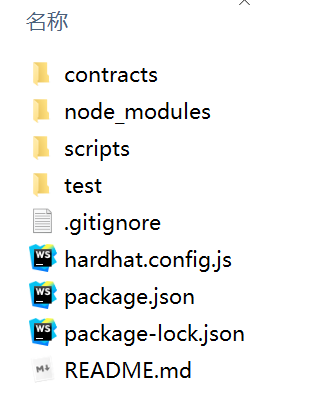
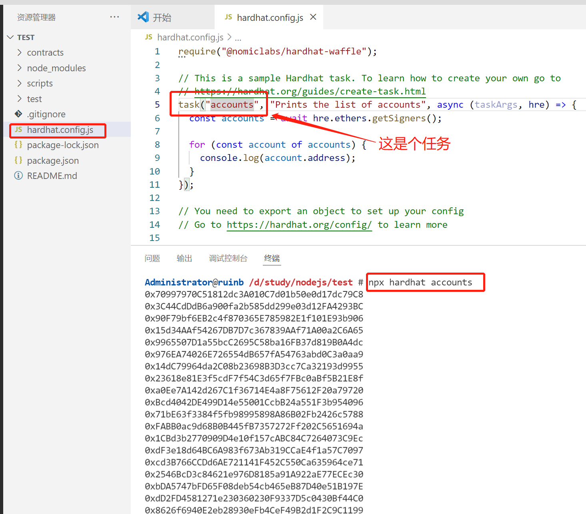
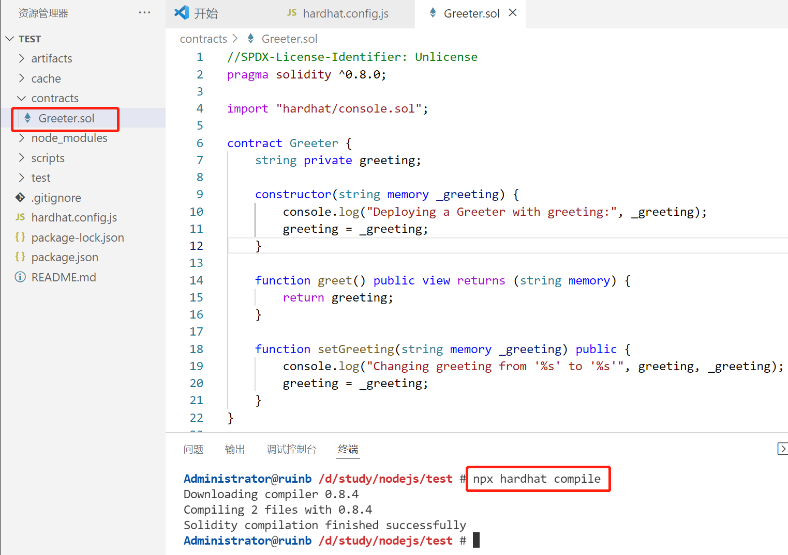

# hardhat 项目

## 1. 安装

```bash
npm i -g hardhat typescript ts-node
```

## 2. 创建项目

```bash
npx hardhat
```

出现下几个文件:



## 3. 安装项目依赖

```bash
npm i --save-dev @nomiclabs/hardhat-waffle ethereum-waffle chai @nomiclabs/hardhat-ethers ethers
```

## 4. 运行accounts任务

```bash
npx hardhat account
```



## 5. 编译合约

```bash
npx hardhat compile
```



## 6. 部署合约

```bash
npx hardhat run scripts/sample-script.js    # 这个部署是什么情况，不需要连接链吗。
```


## 7.  启动本地节点

```bahs
npx hardhat node
```


## 8. 连接钱包或Dapp, 部署到节点

```bash
npx hardhat run scripts/sample-script.js --network localhost
```

