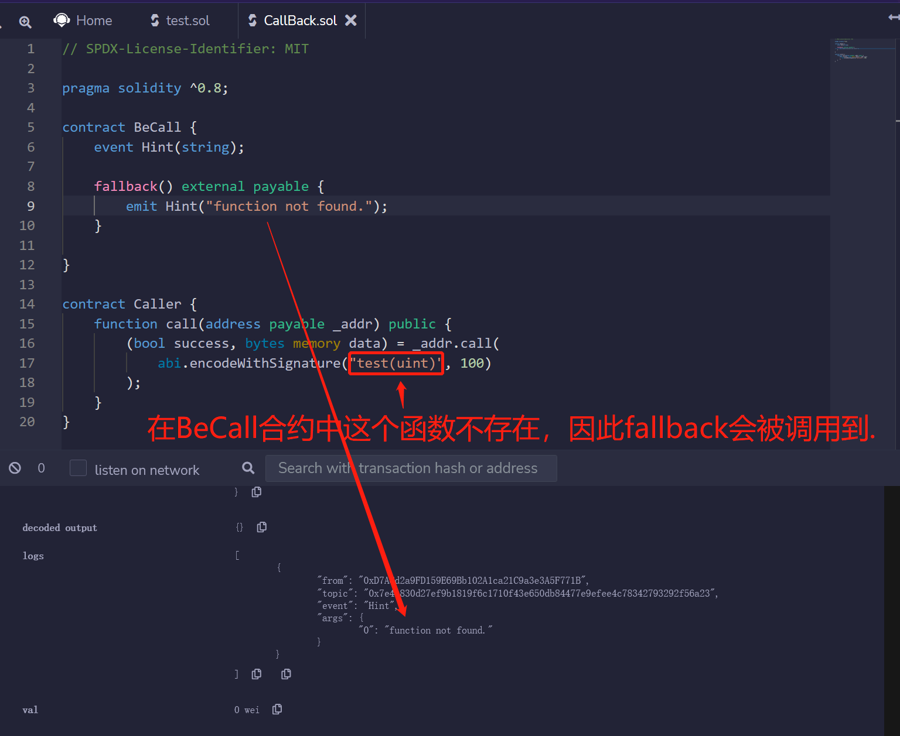
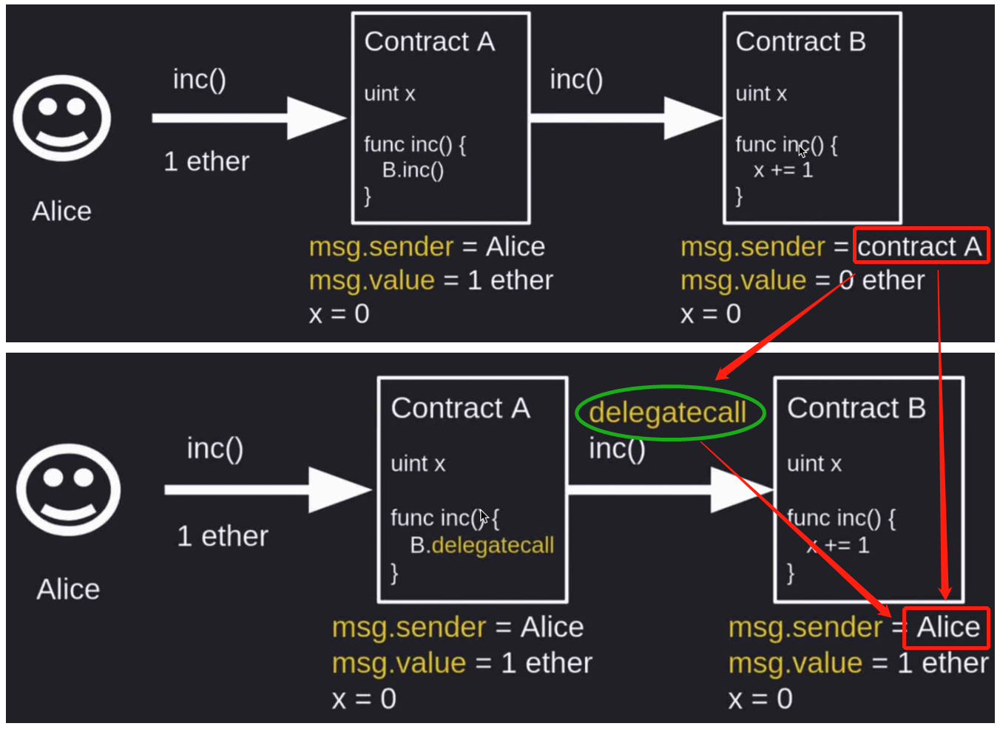
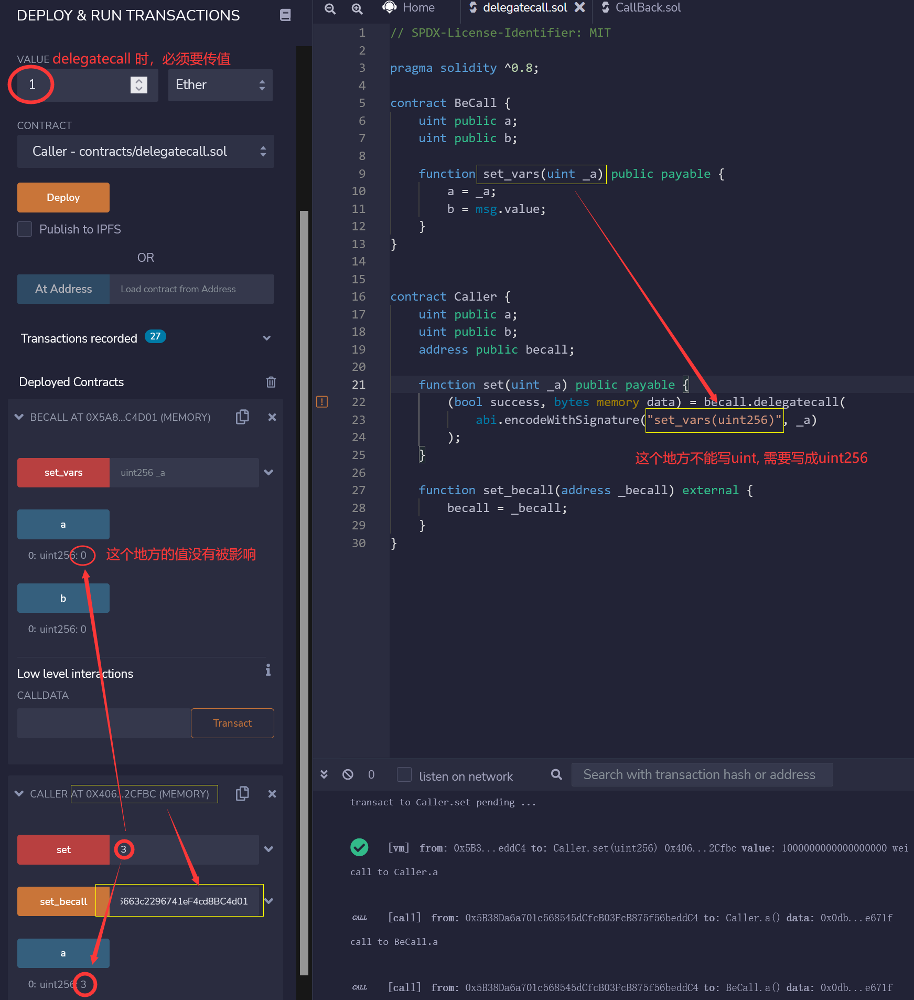
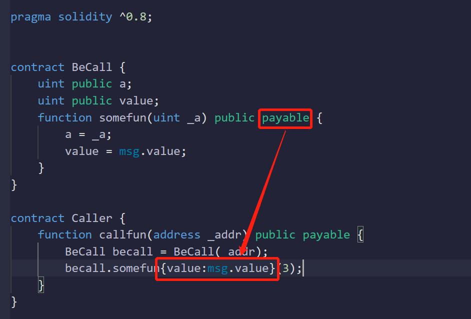

# solidity

## 1. 许可及版本

```js
// SPDX-License-Identifer: MIT
pragma solidity ^0.8;
```

## 2. transfer, send, call

- transfer和send都有固定的gas费限制，因此做某些操作时，有可能会失败，因此不推荐使用
- 另外transfer和send也容易收到黑客攻击，因此也不推荐使用
- 尽可能使用call函数

```js
contract SendEther {
	//transfer	地址需要设置成payable的。
    function transfer(address payable _to) public payable {
        _to.transfer(msg.value);
    }
    
    //send	需要进行判断后，在觉得是否要返回
    function send(address payable _to) public payable {
        bool sent = _to.send(msg.value);
        require(sent, "failed to send eth");
    }
    
    //call	gas费不受限制
    function call(address payable _to) public payable {
        (bool sent, bytes memory data) = _to.call{value:msg.value}("");
        require(sent, "failed to send eth");
    } 
}
```

## 3. 合约接收ether

合约要想接收ether，或者说从别的账户转账过来的ether，合约需要实现两个函数。

```js
receive() external payable {}		//msg.data为空时触发
fallback() external payable {}		//msg.data不为空时触发，或者当前某个函数不存在时会被调用到。
```

这两个函数都有gas费限制，因此他们里面的逻辑不建议太复杂。

## 4. fallback

- 调用当前合约中的某个函数不存在时，fallback函数会被调用到



## 5. delegatecall

- 基本原理 --- 经过delegatecall后，B合约调用者msg.sender不再是A合约了，而是经过A合约传递给了B。



- 调用 detegatecall 的函数，msg.value不能为0，就是说必须携带费用



- delegatecall本质上还是在把其他跟自己当前合约成员变量布局相同的合约中的某个方法，拿到本合约里来使用。并不会影响被调用合约中的成员变量值。

## 6. {msg.xxx} 相关

凡是带payable的函数，别的合约在调用这个函数的时候，都可以通过如下形式进行调用:

```js
xxxContract.callFunc{value:msg.value, data:msg.data}(_args);
```



## 7. 用合约创建合约

- 不带payable传值创建合约

```js
// SPDX-License-Identifier: MIT
pragma solidity ^0.8;

contract BeCreate {
    address public factory ;
    constructor() {
        factory = msg.sender;
    }
}

contract Factory {
    BeCreate[] public all;

    function create() public {
        BeCreate be = new BeCreate();
        all.push(be);
    }
}
```

- 带payable传值创建合约

```js
// SPDX-License-Identifier: MIT
pragma solidity ^0.8;

contract BeCreate {
    address public factory ;
    constructor() payable {				//此处带了payable
        factory = msg.sender;
    }
}

contract Factory {
    BeCreate[] public all;

    function create() public payable {	//此处带了payable
        BeCreate be = (new BeCreate){value:msg.value}();	//形式变化
        all.push(be);
    }
}
```

## immutable, constant

- constant —— 是在编译的时候，就要确定固定值

- immutable —— 是在编译和部署的时候，都可以设置固定值

