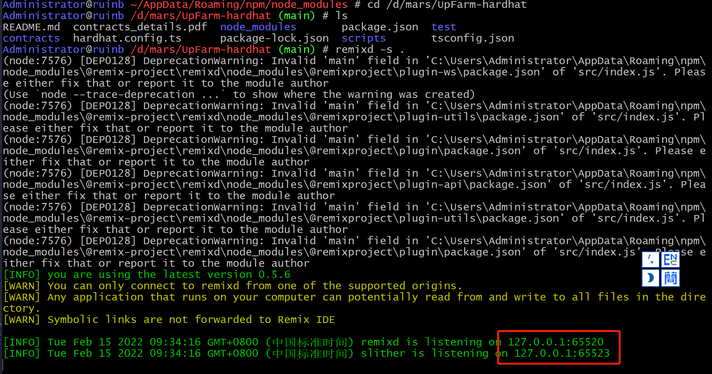
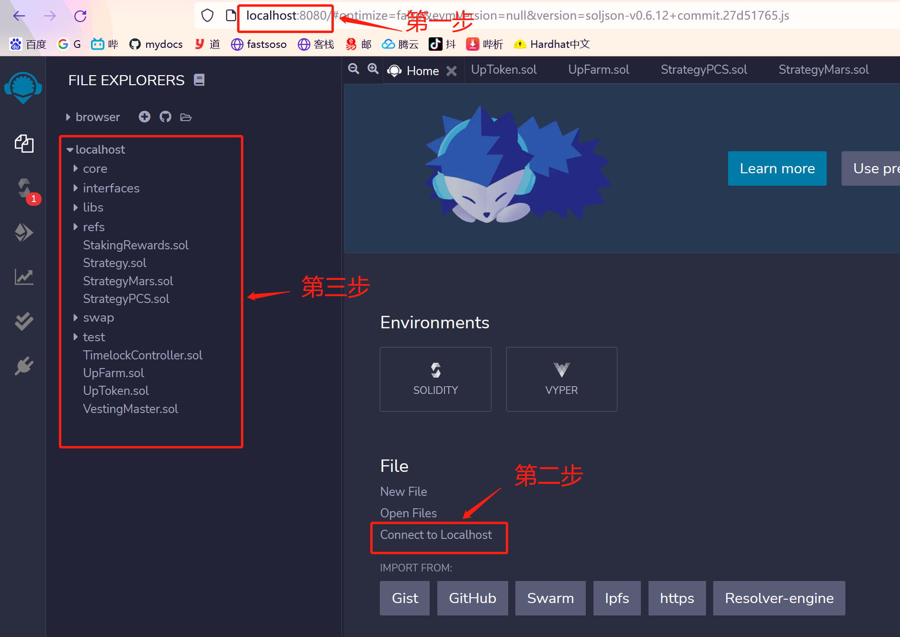

# remix 本地安装

## 1. 安装nodejs

> 这部分不在描述

## 2. 安装remix

```shell
npm i -g remix-ide

# 进入全局安装目录
cd /c/Users/Administrator/AppData/Roaming/npm/node_modules

# 回退http-server版本
rm remix-ide/http-server -rvf
npm i -g http-server@0.9.0
```

## 3. 安装remixd

```bash
npm i -g @remix-project/remixd		# 早期是 npm i -g remixd , 现在已经丢弃

# 进入全局安装目录
cd /c/Users/Administrator/AppData/Roaming/npm/node_modules

# 拷贝目录
cp -rvf @remix-project/remixd .		# remixd运行时，需要这个目录

#修改package.json
#修改  "main": "index.js" 为   "main": "src/index.js"
```

## 4.运行

remixd 本质上是单独运行的一个程序，用来remix-ide连接本地合约开发目录的一个工具。

本地remix-ide启动时会自动的启动本地remixd。

### 4.1 启动remix-ide

```bash
remix-ide
```

### 4.2 启动remixd

```bash
remixd -s <contract dir>	# 想服务合约目录
```



